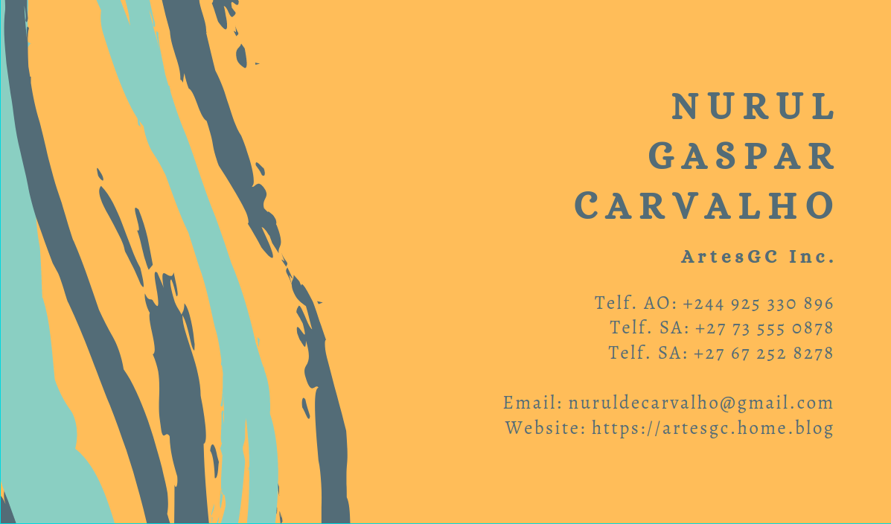

# Olá Colega 👋

Aqui estão algumas idéias sobre mim para você começar:

- 🔭 Atualmente, estou trabalhando em muitos projetos sobre minha marca **[ArtesGC](https://artesgc.home.blog)**
- 🌱 Atualmente estou aprendendo **(NodeJS, TypeScript, Java, Dart)**
- 👯 Estou procurando colaborar no desenvolvimento social
- 🤔 Estou procurando ajuda para muitos projetos, tente entrar em contato comigo!
- 💬 Me pergunte sobre qualquer coisa **[Nurul Carvalho](mailto:nuruldecarvalho@gmail.com)**
- 📫 Como me encontrar:
  - WhatsApp: [+27 73 555 0878](https://api.whatsapp.com/send?phone=27735550878)
  - Telegram: [Nurul GC](https://t.me/NurulGC)
  - Facebook: [NH GC](https://facebook.com/nurulhosny.gc/)
  - Instagram: [NurulGC](https://www.instagram.com/nurulhgc/)
  - Twitter: [Nurul-GC](https://twitter.com/NurulGC3)
  - Linkedin: [Nurul Carvalho](https://www.linkedin.com/in/nurul-carvalho-4a64b01b4/)
- 😄 Apelidos: **Nuninha** ou **GC**

**Conheça também o pequeno resumo sobre os meus [repositórios](https://nurul-gc.github.io/intro/)** 🤓

# Hi Coleague 👋

Here are some ideas about me to get you started:

- 🔭 I’m currently working on many projects about my trademark **[ArtesGC](https://artesgc.home.blog)**
- 🌱 I’m currently learning **(NodeJS, TypeScript, Java, Dart)**
- 👯 I’m looking to collaborate on social development
- 🤔 I’m looking for help with many projects, please try to reach me!
- 💬 Ask me about anything **[Nurul Carvalho](mailto:nuruldecarvalho@gmail.com)**
- 📫 How to reach me:
  - WhatsApp: [+27 73 555 0878](https://api.whatsapp.com/send?phone=27735550878)
  - Telegram: [Nurul GC](https://t.me/NurulGC)
  - Facebook: [NH GC](https://www.facebook.com/nurulhosny.gc/)
  - Instagram: [NurulGC](https://www.instagram.com/nurulhgc/)
  - Twitter: [Nurul-GC](https://twitter.com/NurulGC3)
  - Linkedin: [Nurul Carvalho](https://www.linkedin.com/in/nurul-carvalho-4a64b01b4/)
- 😄 Nicknames: **Nuninha** or **GC**

**See also the short summary about my [repositories](https://nurul-gc.github.io/intro/)** 🤓

# Mais Detalhes - More Details 💻

**Linguagens dominantes** \

**Meu resumo do GitHub** \

**Conquistas - Trophies** \

**Contagem de visitantes anuais - Counting yearly visitors** \

# Perfis sociais - Social profiles 🤓

 \

