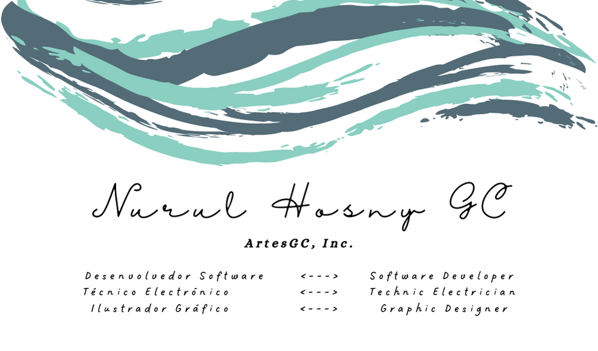
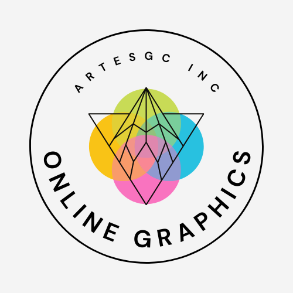
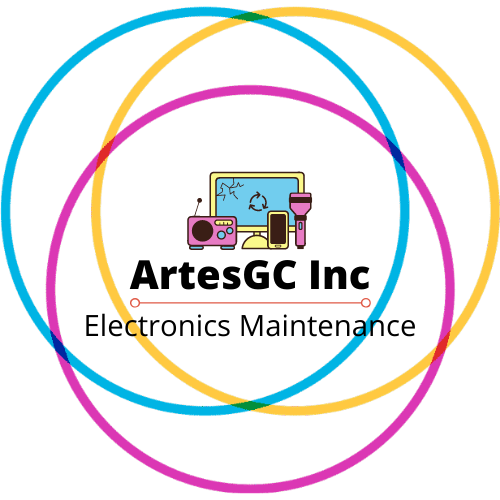
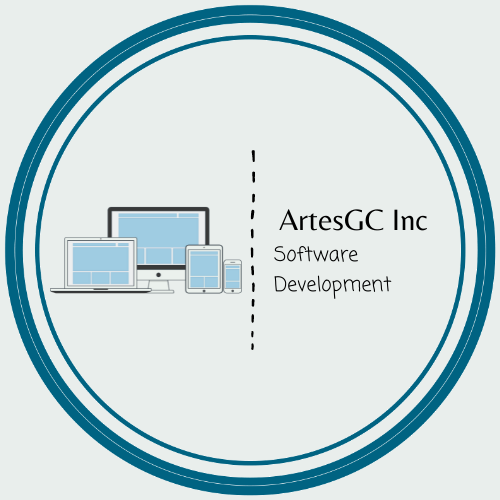

***My position on the contribution rank for Angolan users:***

  
  ## Olá Colega 

  `Aqui esta uma breve introdução sobre mim:`
  

  
- 🔭 Atualmente estou trabalhando em muitos projetos em nome da minha marca **[ArtesGC Inc.](https://github.com/ArtesGC)**;
- 🌱 Também estou estudando e aperfeiçoando as minhas hablidades em: 
  - `Ilustração Gráfica`;
  - `Organização e Responsividade em Web-Apps`;
  - `Serviços Java-Backend`;
- 👯 Estou procurando colaborar no `desenvolvimento social` e `projetos open-source`;
- 🤔 Mas igualmente, preciso de ajuda em muitos projetos, tente entrar em contato comigo:
  - 💬 Me pergunte sobre qualquer coisa **[por email](mailto:nuruldecarvalho@gmail.com)**.
- 📫 Ou ainda:
  - WhatsApp:
    - [+27 73 555 0878](https://api.whatsapp.com/send?phone=27735550878)
    - [+244 925 330 896](https://api.whatsapp.com/send?phone=244925330896)
  - Telegram: [Nurul GC](https://t.me/NurulGC)
  - Facebook: [Nurul Hosny GC](https://facebook.com/nurulhosny.gc/)
  - Instagram: [Nurul HGC](https://www.instagram.com/nurulhgc/)
  - Twitter: [Nurul-GC](https://twitter.com/NurulGC3)
  - Linkedin: [Nurul Carvalho](https://www.linkedin.com/in/nurul-carvalho-4a64b01b4/)
- 😄 Apelidos: **Nuninha** ou **GC**;

🤓 **Conheça também, um pequeno resumo sobre os meus [repositórios](https://nurul-gc.github.io/intro/)...**
  

---

  
  ## Hi Coleague 

  `Here is a brief introduction about me:`
  

- 🔭 Currently, I’m working on many projects by my trademark **[ArtesGC](https://github.com/ArtesGC)**;
- 🌱 I’m also studying and improving my skills on:
  - `Graphic Design`;
  - `Organization and Responsiveness in Web-Apps`;
  - `Java-Backend Services`;
- 👯 I’m looking to collaborate on `social development` and `open-source projects`;
- 🤔 But, I’m also looking for help on many projects, please try to reach me:
  - 💬 Ask me about anything **[by email](mailto:nuruldecarvalho@gmail.com)**.
- 📫 Or still by:
  - WhatsApp:
    - [+27 73 555 0878](https://api.whatsapp.com/send?phone=27735550878)
    - [+244 925 330 896](https://api.whatsapp.com/send?phone=244925330896)
  - Telegram: [Nurul GC](https://t.me/NurulGC)
  - Facebook: [Nurul Hosny GC](https://www.facebook.com/nurulhosny.gc/)
  - Instagram: [Nurul HGC](https://www.instagram.com/nurulhgc/)
  - Twitter: [Nurul-GC](https://twitter.com/NurulGC3)
  - Linkedin: [Nurul Carvalho](https://www.linkedin.com/in/nurul-carvalho-4a64b01b4/)
- 😄 Nicknames: **Nuninha** or **GC**;

🤓 **Also, check out a short summary about my [repositories](https://nurul-gc.github.io/intro/)...**

## Programming Statistics

**Linguagens dominantes** \

**Meu resumo do GitHub** \

  
**My Streak Status** \

**My Trophies** \

**My Brands by [&trade;ArtesGC Inc](https://artesgc.home.blog/)**
  
| Online Graphic | Electronics | DevSoft |
| --- | --- | --- |
|  |  |  |

**My Contribution Status (Snake Game)**

**Views on my Profile** \

&copy; 2019-2022 Nurul-GC

